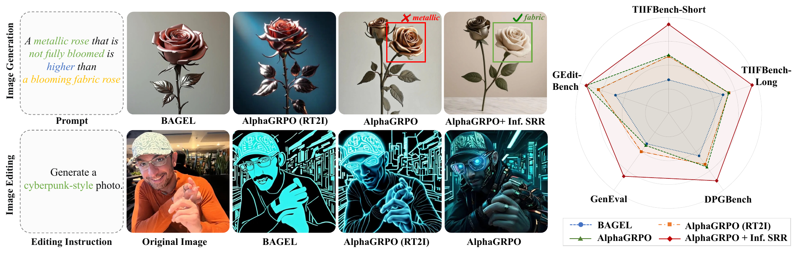
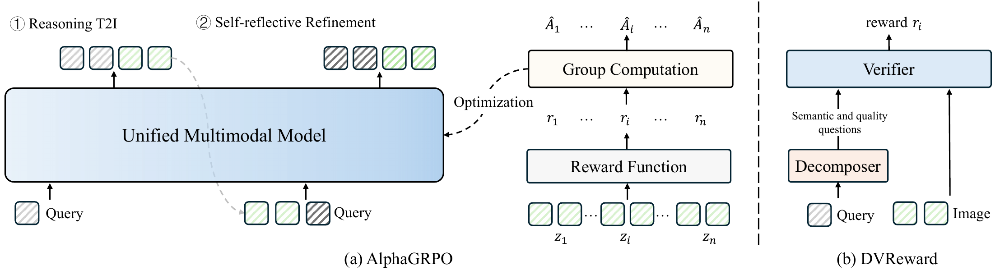
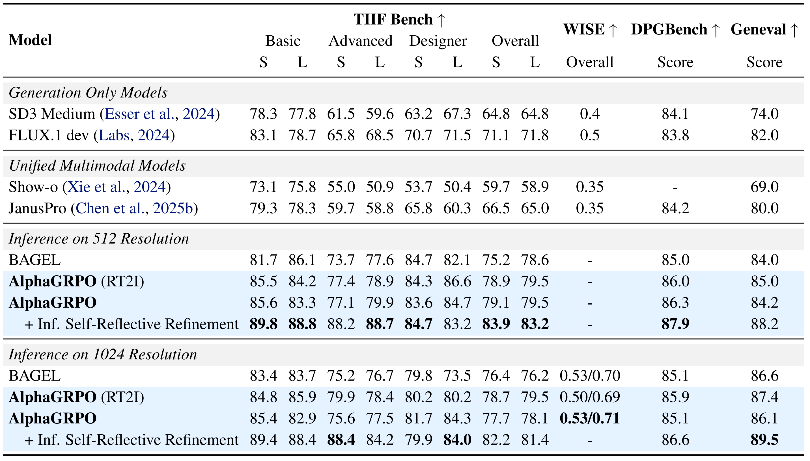
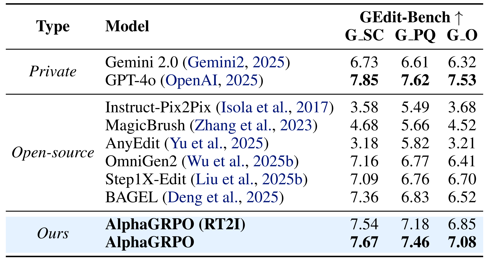

<div align="center">

# AlphaGRPO

<!-- Replace the placeholder arXiv ID when the final link is available. -->
[](https://arxiv.org/)
[](https://huangrh99.github.io/AlphaGRPO)
[](LICENSE)
<!-- [](https://huggingface.co/) -->
</div> 

This is the official repo for AlphaGRPO: Self-Reflective Multimodal Generation via Decompositional Verifiable Reward.

AlphaGRPO enables multimodal generation RL training across text and image generation for AR-Diffusion-native unified multimodal models, such as [BAGEL](https://github.com/bytedance-seed/BAGEL). It supports training on reasoning text-to-image generation and self-reflective refinement.

This codebase flexibly supports different RL methods for image and text generation: FlowGRPO, DiffusionNFT, and AWM for images; GRPO for text.

<p align="center">
  
</p>

## 📣 Updates

- [2026.05.13]: We released the paper on arXiv!
- [Coming soon]: The training code and model weights are currently undergoing internal review and will be released once approved.


## 🏗️ Overview of Framework

<p align="center">
  
</p>

## 📊 Main Results

<p align="center">
  
</p>

> **Text-to-image benchmarks.** RT2I denotes the AlphaGRPO variant trained on the reasoning text-to-image task. Inf. SRR denotes inference-time self-reflective refinement.

<p align="center">
  
</p>

> **GEdit-Bench-EN.** Editing transfer performance — AlphaGRPO improves GEdit scores without training on editing tasks.

## ✏️ Citation

If you find AlphaGRPO useful to your research, please consider citing:
```bibtex
@inproceedings{huang2026alphagrpo,
  title={AlphaGRPO: Unlocking Self-Reflective Multimodal Generation in Unified Multimodal Models via Decompositional Verifiable Reward},
  author={Huang, Runhui and Wu, Jie and Yang, Rui and Liu, Zhe and Zhao, Hengshuang},
  booktitle={International Conference on Machine Learning (ICML)},
  year={2026}
}
```

## 🔒 License

This project is released under the [Apache License 2.0](LICENSE).
