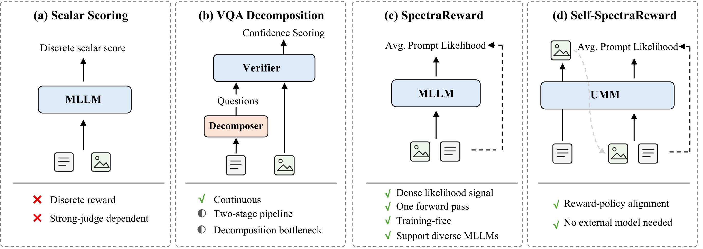
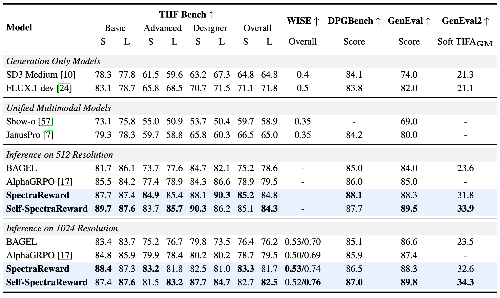
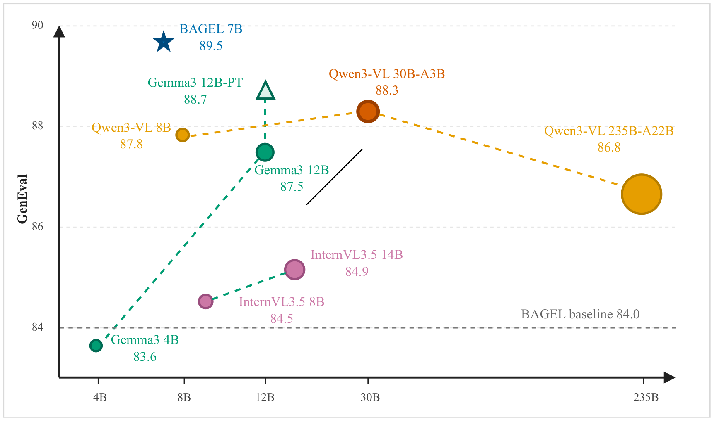

# SpectraReward

**Read It Back: Pretrained MLLMs Are Zero-Shot Reward Models for Text-to-Image Generation**
[Project Page](https://huangrh99.github.io/SpectraReward/)

**SpectraReward** turns a frozen pretrained MLLM into a training-free reward model for text-to-image RL. Instead of asking an MLLM to judge a generated image or to answer decomposed verification questions, SpectraReward measures how well the original prompt can be read back from the generated image: the image is given as visual context and the prompt is scored with a single teacher-forced forward pass. The reward is the mean image-conditioned prompt log-likelihood, `mean log p(prompt | image)`, which directly reuses the MLLM's pretrained image-text alignment with no preference labels and no reward-model fine-tuning.

**Self-SpectraReward** is the unified-model special case: the policy's own understanding branch scores its own generation branch, so the reward is aligned with the policy by construction and no external reward model is needed.

Training-free refers to the reward itself. The image-generation policy is still optimized with reinforcement learning.

## Table of Contents

- [Reward Formulation](#reward-formulation)
- [Training with SpectraReward](#training-with-spectrareward)
- [Using a Different MLLM Backbone](#using-a-different-mllm-backbone)
- [Configs and Checkpoints](#configs-and-checkpoints)
- [Method Comparison](#method-comparison)
- [Results](#results)

---

## Reward Formulation

For a generated image `y` and its prompt `x = (x_1, ..., x_T)`, the frozen MLLM is conditioned on the image and the prompt tokens are teacher-forced in a single pass. The reward is the mean prompt-token log-likelihood:

$$
R_{\mathcal{M}}(x, y)
= \frac{1}{T-1}
\sum_{t=1}^{T-1}
\log p_{\mathcal{M}}\left(x_{t+1} \mid x_{\leq t}, y\right)
$$

A higher score means the image makes its own prompt more predictable, i.e. the image better supports the prompt. End-of-turn and EOS tokens are dropped from the average so template tokens do not dilute the signal, and the score is length-normalized so prompts of different lengths stay comparable. The per-token likelihoods also form a semantic spectrum: drops on specific tokens localize which prompt requirements are weakly supported, while the average is the scalar reward.

The paper analyzes these token-level likelihoods as a semantic spectrum. The released training interface returns their mean as a scalar reward.

<p align="center">
  
</p>

> **Reward formulations.** Scalar scoring produces a discrete judge-dependent signal. VQA decomposition requires a two-stage pipeline. SpectraReward uses prompt likelihood directly, while Self-SpectraReward supplies the same signal from the policy's own understanding branch.

---

## Training with SpectraReward

SpectraReward is a normal reward in this codebase. `spectrareward_t2i_awm` trains T2I with an external frozen reward MLLM, and the `self_spectrareward_t2i_*` configs use BAGEL's own understanding branch.

### External reward with a remote server

For large reward MLLMs, a remote server is recommended. Serve the reward MLLM on dedicated GPUs and point training to it with `SPECTRAREWARD_URL`. The same `spectrareward_t2i_awm` config is used; setting the URL switches scoring to the server automatically.

```bash
# On the reward-server node(s): serve the reward MLLM, 8-way data-parallel.
bash scripts/serve_spectrareward.sh Qwen/Qwen3-VL-30B-A3B-Instruct 0.0.0.0 18090 8
```

```bash
# On the training side: point to the server and launch as usual.
export PYTHONPATH=$PYTHONPATH:$(pwd)/Bagel/
export SPECTRAREWARD_MODEL_ID=Qwen/Qwen3-VL-30B-A3B-Instruct
export SPECTRAREWARD_URL=http://<reward_server_ip>:18090   # IPv6: http://[${ip}]:18090

torchrun --nnodes=$NUM_NODES --node_rank=$RANK --nproc_per_node=8 \
  alpha_grpo/train.py --config config/bagel.py:spectrareward_t2i_awm
```

The model passed to `serve_spectrareward.sh` must match `SPECTRAREWARD_MODEL_ID` on the training side. The URL selects an already running server; it does not change the model loaded by that server.

The final argument to `serve_spectrareward.sh` controls data-parallel replicas. Each GPU loads a complete copy of the reward MLLM. This increases scoring throughput but does not shard one model across multiple GPUs.

The server accepts unauthenticated pickle payloads. Run it only on a trusted network and do not expose it directly to the public internet.

Without `SPECTRAREWARD_URL`, the reward MLLM is loaded inside the training process. In-process scoring runs synchronously so it cannot overlap with the next rollout on the same GPU. This is fine for small reward models but a large one can trigger OOM, so set `SPECTRAREWARD_MODEL_ID` to a small model in that case.

<details>
<summary><b>In-process example with a 7B reward model</b></summary>

```bash
export PYTHONPATH=$PYTHONPATH:$(pwd)/Bagel/
unset SPECTRAREWARD_URL
export SPECTRAREWARD_MODEL_ID=Qwen/Qwen2.5-VL-7B-Instruct

torchrun --nnodes=$NUM_NODES --node_rank=$RANK --nproc_per_node=8 \
  alpha_grpo/train.py --config config/bagel.py:spectrareward_t2i_awm
```

</details>

### Self-SpectraReward

No reward server or extra model is needed; BAGEL scores itself.

```bash
export PYTHONPATH=$PYTHONPATH:$(pwd)/Bagel/

# self_spectrareward_t2i_grpo and self_spectrareward_t2i_nft are also available.
torchrun --nnodes=$NUM_NODES --node_rank=$RANK --nproc_per_node=8 \
  alpha_grpo/train.py --config config/bagel.py:self_spectrareward_t2i_awm
```

---

## Using a Different MLLM Backbone

The SpectraReward formulation is architecture-agnostic, but the released scorer has a concrete compatibility contract. It supports Hugging Face models that can be loaded through `AutoModelForImageTextToText`, whose processor provides a multimodal `apply_chat_template`, and whose forward pass returns next-token logits. Compatible models need no model-specific scorer.

For a compatible backbone, use the same Hugging Face model id when serving and training:

```bash
MODEL_ID=<huggingface_model_id>

# Serve the backbone.
bash scripts/serve_spectrareward.sh "$MODEL_ID" 0.0.0.0 18090 8

# Train against the same backbone.
export SPECTRAREWARD_MODEL_ID="$MODEL_ID"
export SPECTRAREWARD_URL=http://<reward_server_ip>:18090
torchrun --nnodes=$NUM_NODES --node_rank=$RANK --nproc_per_node=8 \
  alpha_grpo/train.py --config config/bagel.py:spectrareward_t2i_awm
```

The released generic scorer has been tested with Gemma3, InternVL3.5, and Qwen3-VL backbones. The paper evaluates these reward-model families across multiple scales and finds consistent improvements over the baseline. Other checkpoints must satisfy the interface described above.

Self-SpectraReward instead reuses BAGEL's understanding branch directly, so it needs no external backbone at all.

---

## Configs and Checkpoints

Configs are in [`config/bagel.py`](../config/bagel.py):

| Config | Reward | Algorithm |
|---|---|---|
| `spectrareward_t2i_awm` | External SpectraReward | AWM |
| `self_spectrareward_t2i_grpo` | Self-SpectraReward | GRPO |
| `self_spectrareward_t2i_awm` | Self-SpectraReward | AWM |
| `self_spectrareward_t2i_nft` | Self-SpectraReward | DiffusionNFT |

Released BAGEL-7B-MoT LoRA adapters. To evaluate one, follow the [Evaluation](../README.md#-evaluation) section.

| Model | Reward |
|---|---|
| [Bagel-Self-SpectraReward-AWM](https://huggingface.co/huangrh9/Bagel-Self-SpectraReward-AWM) | Self-SpectraReward |
| [Bagel-SpectraReward-AWM-Qwen3VL-30B-A3B](https://huggingface.co/huangrh9/Bagel-SpectraReward-AWM-Qwen3VL-30B-A3B) | External SpectraReward, Qwen3-VL-30B-A3B-Instruct |

---

## Method Comparison

Pretrained MLLMs can be turned into rewards in several ways. Scalar scoring prompts the MLLM to rate alignment on a 1-5 scale, which is discrete and sensitive to judge calibration. VQA decomposition splits the prompt into yes/no questions and aggregates `P(yes)`, as in AlphaGRPO's DVReward, which is continuous but needs a two-stage pipeline. SpectraReward instead reads the prompt back from the image, giving a dense, training-free signal that works across MLLM families.

Reward-function ablation on BAGEL with AWM:

| Reward function | GenEval ↑ | TIIF-Short ↑ | TIIF-Long ↑ |
|---|---|---|---|
| BAGEL, no RL | 84.0 | 75.2 | 78.6 |
| Scalar Scoring, 1-5 | 77.7 | 67.5 | 76.0 |
| VQA-Score, P(yes) | 83.1 | 77.4 | 78.9 |
| Prompt Likelihood, ours | **89.5** | **85.1** | **84.3** |

---

## Results

Across text-to-image backbones, RL algorithms, and reward MLLM families, SpectraReward and Self-SpectraReward consistently improve the BAGEL baseline and outperform AlphaGRPO on TIIF-Bench, DPG-Bench, GenEval, GenEval2, and WISE, at both 512 and 1024 resolution. Headline gains over BAGEL are +10.0 TIIF-Short for SpectraReward and +5.5 GenEval for Self-SpectraReward.

<p align="center">
  
</p>

> **Main results.** SpectraReward and Self-SpectraReward improve BAGEL across the reported benchmarks and resolutions. Bold values mark the best result in each comparison group.

**Reward-policy alignment can rival scale.** Self-SpectraReward reaches the best GenEval at 89.5 and surpasses every external reward MLLM in this study, including Qwen3-VL-30B-A3B and the much larger Qwen3-VL-235B-A22B. Reward quality is not determined by scale alone.

<p align="center">
  
</p>

> **Reward MLLM scale.** External gains are non-monotonic, while BAGEL's own understanding branch provides the strongest GenEval reward signal.

**Bigger is non-monotonic; pretraining helps.** Within Qwen3-VL, going from 8B to 30B improves GenEval but 235B drops, so a roughly 30B MLLM already unlocks most of the benefit. Gemma3-12B pretrain also beats its instruct counterpart, since captioning-style pretraining matches SpectraReward's objective more closely.

**Optimizer.** Holding the reward fixed to Self-SpectraReward, AWM is the most effective optimizer over FlowGRPO and DiffusionNFT, and Self-SpectraReward outperforms HPSv3, UnifiedReward, VIEScore, and DVReward under comparable training.

See the [project page](https://huangrh99.github.io/SpectraReward/) for the full tables, qualitative comparisons, and figures.
